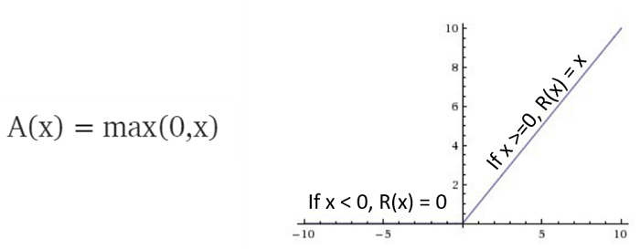

## Bio_Art
### Understanding Biological and Artifical neural networks
This notebook that sets out to describe Biological & Artificial Neural networks and to understand some key concepts specifically geared towards health professionals.

## Background
### Biological Networks
A biological network is any network that applies to biological systems.

Biological systems are often represented as networks which are complex sets of binary interactions or relations between different entities. Essentially, every biological entity has interactions with other biological entities, from the molecular to the ecosystem level, providing us with the opportunity to model biology using many different types of networks such as ecological, neurological, metabolic or molecular interaction networks.

Systems biology aims to understand biological entities at the systemic level, analysing them not only as individual components, but also as interacting systems and their emergent properties. Related to this is network biology which allows the representation and analysis of biological systems using tools derived from graph theory.

Network theory is the study of graphs as a representation of either symmetric relations or asymmetric relations between discrete objects. In computer science and network science, network theory is a part of graph theory: a network can be defined as a graph in which nodes and/or edges have attributes

  

There are a number of networks in biology and the one that is of particular importance in this case are Neuronal networks

The complex interactions in the brain make it a perfect candidate to apply network theory. Neurons in the brain are deeply connected with one another and this results in complex networks being present in the structural and functional aspects of the brain

A neural circuit is a population of neurons interconnected by synapses to carry out a specific function when activated.

One principle by which neurons work is neural summation – potentials at the postsynaptic membrane will sum up in the cell body. If the depolarization of the neuron at the axon goes above threshold an action potential will occur that travels down the axon to the terminal endings to transmit a signal to other neurons.

Summation, which includes both spatial and temporal summation, is the process that determines whether or not an action potential will be generated by the combined effects of excitatory and inhibitory signals, both from multiple simultaneous inputs (spatial summation), and from repeated inputs (temporal summation). Depending on the sum total of many individual inputs, summation may or may not reach the threshold voltage to trigger an action potential.

  

At any given moment, a neuron may receive postsynaptic potentials from thousands of other neurons. Whether threshold is reached, and an action potential generated, depends upon the spatial (i.e. from multiple neurons) and temporal (from a single neuron) summation of all inputs at that moment. It is traditionally thought that the closer a synapse is to the neuron's cell body, the greater its influence on the final summation

### Weights
In neuroscience and computer science, synaptic weight refers to the strength or amplitude of a connection between two nodes, corresponding in biology to the amount of influence the firing of one neuron has on another. The term is typically used in artificial and biological neural network research. Each connection between two neurons has a unique synapse with a unique weight attached to it.

### Artificial Intelligence
Deep Learning is a subset of Machine Learning and Machine Learning is turn a subset of Artificial Intelligence. This illustration explains the relationships between the three entities

  

  

### Biological Neuron

  

It is easier to understand how a biological neuron works by breaking down the process into 3 phases:

First phase can be referred to as the input phase where the dendrites gather inputs through synaptic pathways, in biological terms this is referred to as impulses that may travel from other neurons .
Second phase consists of the main cell body which consists of the cell nucleus, which is the cells control centre. Here it is important to understand that if the resulting activation exceeds a certain threshold it generates an action potential that propagates into the third phase
Third phase is the output phase where the axon carries the signal to the next cell or neuron provided as mentioned before that a certain threshold has been reached.

### Artificial Neuron

  

Again to make it easier to understand how artificial neurons work, we break it down into 3 phases:

First phase Involves an input which is multiplied to a weight
Second phase Summation of inputs
Third phase Use of an activation function to compute an output

### Phase 1 - Input Phase

  

he input phase consists of an input, x which is multiplied to a weight.
Inputs can be images, words, sentences, for this tutorial we are going to use images as the input

It is important to understand that inputs can be images or words but whatever the input is the computer has to convert this into a numerical form so that it can understand the input.

Images can be broken down into pixels where each pixel has a value between 0 and 255

  

### Phase 2

  

### Phase 3 - Activation Function

  

In artificial neural networks, the activation function of a node defines the output of that node, or "neuron," given an input or set of inputs. This output is then used as input for the next node and so on until a desired solution to the original problem is found

It maps the resulting values into the desired range such as between 0 to 1 or -1 to 1 etc. (depending upon the choice of activation function). For example, the use of the logistic activation function would map all inputs in the real number domain into the range of 0 to 1.

There are a number of activation functions as described below.

### Sigmoid Activation Function

  

### Tanh Activation Function

The tanh function, a.k.a. hyperbolic tangent function, is a rescaling of the logistic sigmoid, such that its outputs range from -1 to 1.

A logistic function or logistic curve is a common "S" shape (sigmoid curve), with equation:

  

## Relu Activation Function

In the context of artificial neural networks, the rectifier is an activation function defined as the positive part of its argument
where x is the input to a neuron. This is also known as a ramp function and is analogous to half-wave rectification in electrical engineering. This activation function was first introduced to a dynamical network by Hahnloser et al. in 2000 with strong biological motivations and mathematical justifications. It has been demonstrated for the first time in 2011 to enable better training of deeper networks, compared to the widely-used activation functions prior to 2011, e.g., the logistic sigmoid (which is inspired by probability theory; see logistic regression) and its more practical. counterpart, the hyperbolic tangent. The rectifier is, as of 2018, the most popular activation function for deep neural networks.

A unit employing the rectifier is also called a rectified linear unit (ReLU)

  

### Softmax Activation Function

The softmax function is a function that takes as input a vector of K real numbers, and normalizes it into a probability distribution consisting of K probabilities

  

### Review the Jupyter Notebook for more information
